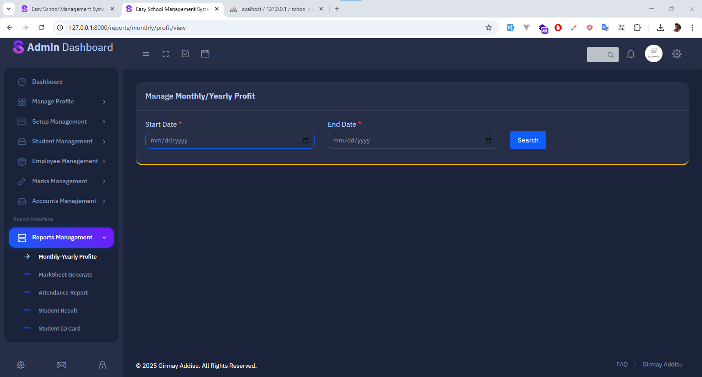

# 🏫 School Management System

A comprehensive web-based School Management System built with Laravel that streamlines administrative tasks, student management, employee management, and academic operations for educational institutions.

## 📋 Table of Contents

- [Features](#features)
- [Screenshots](#screenshots)
- [Installation](#installation)
- [System Modules](#system-modules)
- [Technologies Used](#technologies-used)

## ✨ Features

### 👥 User Management
- Multi-role user system (Admin, Staff, Teachers)
- User profile management
- Password change functionality
- Role-based access control

### 🎓 Student Management
- Student registration and enrollment
- Roll number generation
- Student promotion system
- Fee management (Registration, Monthly, Exam fees)
- Student ID card generation

### 👨‍🏫 Employee Management
- Employee registration and profiles
- Salary management and increments
- Leave management system
- Attendance tracking
- Monthly salary processing

### 📚 Academic Management
- Class and year setup
- Subject management and assignment
- Exam type configuration
- Marks entry and grading system
- Grade management

### 💰 Financial Management
- Fee category and amount setup
- Student fee collection
- Employee salary payments
- Other cost management
- Financial reporting

### 📊 Reports & Analytics
- Monthly/Yearly profit reports
- Mark sheet generation
- Attendance reports
- Student result reports
- Comprehensive dashboard analytics

## 📸 Screenshots

### Login

*User authentication page for secure access*

### Dashboard

*Main dashboard with overview statistics and quick access menu*

### Settings

*System configuration and setup management*

### Student Management

*Student registration and management interface*

### Employee Management

*Employee registration and salary management*

### Mark Management

*Marks entry, grading, and report card generation*

### Account Management

*Fee collection, salary payments, and financial tracking*

### Reports

*Comprehensive reporting system with various report types*

## 🏗️ System Modules

### 📋 Setup Management
- **Student Classes**: Define academic classes
- **Academic Years**: Manage school years
- **Student Groups**: Organize student groups
- **Student Shifts**: Configure class shifts
- **Fee Categories**: Set up different fee types
- **Exam Types**: Define examination categories
- **Subjects**: Manage school subjects
- **Designations**: Employee position management

### 👨‍🎓 Student Operations
- Student registration and enrollment
- Roll number assignment
- Fee collection and tracking
- Academic record management
- Promotion handling

### 👥 Employee Operations
- Staff registration and profiles
- Attendance management
- Leave tracking
- Salary processing
- Performance monitoring

### 📝 Academic Operations
- Marks entry and management
- Grade calculation
- Report card generation
- Subject assignment
- Examination management

### 💼 Financial Operations
- Fee collection tracking
- Salary disbursement
- Expense management
- Financial reporting
- Profit/loss analysis

## 🛠️ Technologies Used

- **Backend**: Laravel 8.x (PHP Framework)
- **Frontend**: Bootstrap 4, jQuery, HTML5, CSS3
- **Database**: MySQL
- **Authentication**: Laravel Jetstream
- **Charts**: C3.js, Chart.js
- **PDF Generation**: DomPDF
- **Icons**: Feather Icons, Font Awesome
- **Editor**: CKEditor
- **Scrollbar**: Perfect Scrollbar

**Made with ❤️ for Educational Institutions**

*Streamline your school management with our comprehensive solution!*
